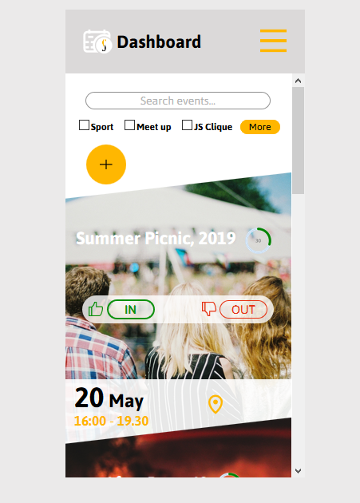

### HTML & CSS market for Eventify React Ap

I have created this HTML and CSS for our Eventify React App for our dem day. I first designed the mock up in Adobe XD and eventually transform into code and make it ready to be converted into React App. different component.

Happy Coding 😀.

### Demo

You can see the live demo of the App here:

Adobe XD Mockup: [Eventify Event Manager -mobile](https://xd.adobe.com/view/3571d1a3-b0b2-47b3-6771-678a0a2a1928-4340/screen/676d1d94-0ae3-4bbe-a2ff-f3da2bd3c16b/Dashboard?fullscreen)

Live website (HTML, CSS, JS): [(Eventify Event Manager -HTML,CSS,JS/)](https://sulaymon333.github.io/eventify-app-no-react/)

# 

### Author

Sulaymon Tajudeen. [Learn More](https://sulaymontajudeen.com/)

### Technologies

- HTML
- CSS
- javaScript (Vanilla)

### License

This project is licensed under the MIT License - see the [LICENSE.md](./LICENSE.md) file for details.